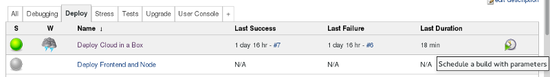
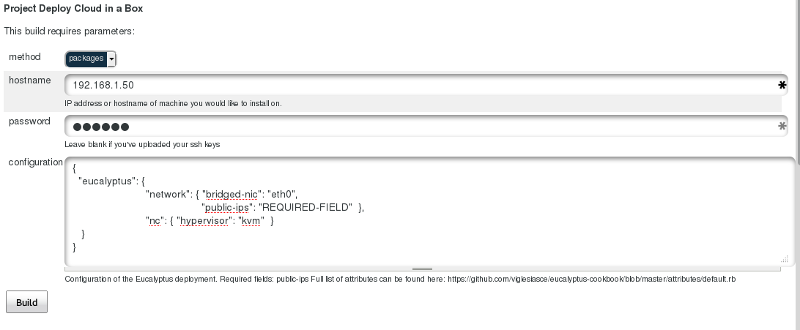

Deploy a Cloud or Application
=============================

This section of the documentation explains different deployment options from Micro QA project.

First click on the deploy tab and you will see different deployment options.

Deploy Eucalyptus Cloud in a box
--------------------------------

Use this option to deploy `Eucalyptus <http://eucalyptus.com>`_ cloud in a single system. The target system should already have a freshly installed CentOS6.5.
You need the root password and IP of the system.

.. note:: Remember to install **ntp** service in the target system and start the service before you start deploying.

First click on the right most column for scheduling a build with parameters.

This will open up a form which has a few basic questions for you. It can install both from *packages* (which is RPM packages)
and also from direct git checkouts (source).

Enter the **hostname** and **password** of the target system. Remember to edit the configuration which is basically a JSON text.
You will have to update the bridged-nic of the system (that is the NIC to be used for bridge) and public ip range.
An example of the JSON data can be like the following.

::

	{
	  "eucalyptus": { 
	                         "network": { "bridged-nic": "eth0", 
	                                            "public-ips": "192.168.1.100-192.168.1.150"  },
	                         "nc": { "hypervisor": "kvm"  } 
	   }
	} 

After filling up all required fields just hit *Build* button and check the console output. At the end you will have `Eucalyptus <http://eucalyptus.com>`_  cloud deployed in the target which will be ready for use. 